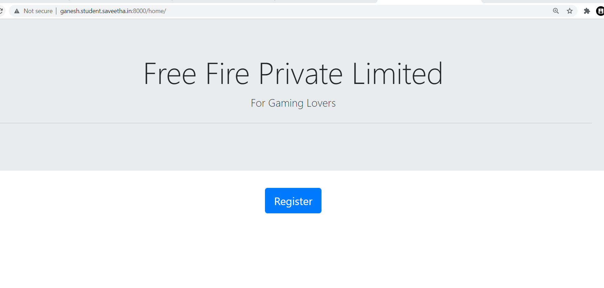

# WebApplication for Event Registration

## AIM:
To create a UX design and develop a web application for event registration.
## DESIGN STEPS:


## DESIGN SCREENS:


## WIREFRAME:
## PROTOTYPE:


## PROGRAM:
## home.html

```
<!doctype html>
<html lang="en">

<head>
    <!-- Required meta tags -->
    <meta charset="utf-8">
    <meta name="viewport" content="width=device-width, initial-scale=1, shrink-to-
fit=no">
    <!-- Bootstrap CSS -->
    <link rel="stylesheet" href="https://maxcdn.bootstrapcdn.com/bootstrap/4.0.0/css/bootstrap.min.css" integrity="sha384-
Gn5384xqQ1aoWXA+058RXPxPg6fy4IWvTNh0E263XmFcJlSAwiGgFAW/dAiS6JXm" crossorigin="anonymous">
    <title>Home</title>
</head>

<body>
    <div class="jumbotron jumbotron-fluid">
        <div class="container text-center">
            <h1 class="display-4">WORKING ON DANCE</h1>
            <p class="lead">DANCE TO EXPRESS NOT TO IMPRESS</p>
            <hr class="my-4">
        </div>
    </div>
    <div class="container text-center">
        <div class='row '>
        </div>
        <a href="/register/" class="btn btn-primary btn-lg" role="button">Register</a>
    </div>
    <script src="https://code.jquery.com/jquery-3.2.1.slim.min.js" integrity="sha384-
KJ3o2DKtIkvYIK3UENzmM7KCkRr/rE9/Qpg6aAZGJwFDMVNA/GpGFF93hXpG5KkN" crossorigin="anonymous"></script>
    <script src="https://cdnjs.cloudflare.com/ajax/libs/popper.js/1.12.9/umd/popper.min.js" integrity="sha384-
ApNbgh9B+Y1QKtv3Rn7W3mgPxhU9K/ScQsAP7hUibX39j7fakFPskvXusvfa0b4Q" crossorigin="anonymous"></script>
    <script src="https://maxcdn.bootstrapcdn.com/bootstrap/4.0.0/js/bootstrap.min.js" integrity="sha384-
JZR6Spejh4U02d8jOt6vLEHfe/JQGiRRSQQxSfFWpi1MquVdAyjUar5+76PVCmYl" crossorigin="anonymous"></script>
</body>

</html>
```
## register.html
```
<!doctype html>
<html lang="en">

<head>
    <!-- Required meta tags -->
    <meta charset="utf-8">
    <meta name="viewport" content="width=device-width, initial-scale=1, shrink-to-
fit=no">
    <!-- Bootstrap CSS -->
    <link rel="stylesheet" href="https://maxcdn.bootstrapcdn.com/bootstrap/4.0.0/css/bootstrap.min.css" integrity="sha384-
Gn5384xqQ1aoWXA+058RXPxPg6fy4IWvTNh0E263XmFcJlSAwiGgFAW/dAiS6JXm" crossorigin="anonymous">
    <title>Registration Page</title>
</head>

<body>
    <div class="jumbotron jumbotron-fluid">
        <div class="container text-center">
            <h1 class="display-4">FREE fire Private limited</h1>
            <p class="lead">FOR Gaming lovers</p>
            <hr class="my-4">
        </div>
    </div>
    <div class="container ">
        <div class="col-12 ">
            <form action="" method="POST">
                
                <div class="form-group">
                    <label for="name">Name</label>
                    <input type="text" class="form-control" id="username" placeholder="Enter your Name" name="username">
                </div>
                <div class="form-group">
                    <label for="institute">Institute</label>
                    <input type="text" class="form-control" id="institute" name="institute"
                        placeholder="Enter the Name of the institute">
                </div>
                <div class="form-group">
                    <label for="emailid">Email address</label>
                    <input type="email" class="form-control" id="emailid" name="emailid" placeholder="Enter email">
                </div>
                <div class="form-group">
                    <label for="number">Contact Number</label>
                    <input type="number" class="form-control" id="phnumber" name="phnumber"
                        placeholder="Contact Number">
                </div>
                <button type="submit" class="btn btn-primary btn-lg">Submit</button>
                <a href="/home/" class="btn btn-primary btn-lg" role="button">Home</a>
            </form>
        </div>
    </div>
    <script src="https://code.jquery.com/jquery-3.2.1.slim.min.js" integrity="sha384-
KJ3o2DKtIkvYIK3UENzmM7KCkRr/rE9/Qpg6aAZGJwFDMVNA/GpGFF93hXpG5KkN" crossorigin="anonymous"></script>
    <script src="https://cdnjs.cloudflare.com/ajax/libs/popper.js/1.12.9/umd/popper.min.js" integrity="sha384-
ApNbgh9B+Y1QKtv3Rn7W3mgPxhU9K/ScQsAP7hUibX39j7fakFPskvXusvfa0b4Q" crossorigin="anonymous"></script>
    <script src="https://maxcdn.bootstrapcdn.com/bootstrap/4.0.0/js/bootstrap.min.js" integrity="sha384-
JZR6Spejh4U02d8jOt6vLEHfe/JQGiRRSQQxSfFWpi1MquVdAyjUar5+76PVCmYl" crossorigin="anonymous"></script>
</body>

</html>

```
## listofparticipants
```
<!doctype html>
<html lang="en">

<head>
    <!-- Required meta tags -->
    <meta charset="utf-8">
    <meta name="viewport" content="width=device-width, initial-scale=1, shrink-to-
fit=no">
    <!-- Bootstrap CSS -->
    <link rel="stylesheet" href="https://maxcdn.bootstrapcdn.com/bootstrap/4.0.0/css/bootstrap.min.css" integrity="sha384-
Gn5384xqQ1aoWXA+058RXPxPg6fy4IWvTNh0E263XmFcJlSAwiGgFAW/dAiS6JXm" crossorigin="anonymous">
    <title>Registration Page</title>
</head>

<body>
    <div class="jumbotron jumbotron-fluid">
        <div class="container text-center">
            <h1 class="display-4">FREE fire Private limited</h1>
            <p class="lead">FOR Gaming lovers</p>
            <hr class="my-4">
        </div>
    </div>
    <div class="container ">
        <div class="col-12 ">
            <form action="" method="POST">
                
                <div class="form-group">
                    <label for="name">Name</label>
                    <input type="text" class="form-control" id="username" placeholder="Enter your Name" name="username">
                </div>
                <div class="form-group">
                    <label for="institute">Institute</label>
                    <input type="text" class="form-control" id="institute" name="institute"
                        placeholder="Enter the Name of the institute">
                </div>
                <div class="form-group">
                    <label for="emailid">Email address</label>
                    <input type="email" class="form-control" id="emailid" name="emailid" placeholder="Enter email">
                </div>
                <div class="form-group">
                    <label for="number">Contact Number</label>
                    <input type="number" class="form-control" id="phnumber" name="phnumber"
                        placeholder="Contact Number">
                </div>
                <button type="submit" class="btn btn-primary btn-lg">Submit</button>
                <a href="/home/" class="btn btn-primary btn-lg" role="button">Home</a>
            </form>
        </div>
    </div>
    <script src="https://code.jquery.com/jquery-3.2.1.slim.min.js" integrity="sha384-
KJ3o2DKtIkvYIK3UENzmM7KCkRr/rE9/Qpg6aAZGJwFDMVNA/GpGFF93hXpG5KkN" crossorigin="anonymous"></script>
    <script src="https://cdnjs.cloudflare.com/ajax/libs/popper.js/1.12.9/umd/popper.min.js" integrity="sha384-
ApNbgh9B+Y1QKtv3Rn7W3mgPxhU9K/ScQsAP7hUibX39j7fakFPskvXusvfa0b4Q" crossorigin="anonymous"></script>
    <script src="https://maxcdn.bootstrapcdn.com/bootstrap/4.0.0/js/bootstrap.min.js" integrity="sha384-
JZR6Spejh4U02d8jOt6vLEHfe/JQGiRRSQQxSfFWpi1MquVdAyjUar5+76PVCmYl" crossorigin="anonymous"></script>
</body>

</html>

```
## success.html
```
<!doctype html>
<html lang="en">
  <head>
    <!-- Required meta tags -->
    <meta charset="utf-8">
    <meta name="viewport" content="width=device-width, initial-scale=1, shrink-to-fit=no">

    <!-- Bootstrap CSS -->
    <link rel="stylesheet" href="https://maxcdn.bootstrapcdn.com/bootstrap/4.0.0/css/bootstrap.min.css" integrity="sha384-Gn5384xqQ1aoWXA+058RXPxPg6fy4IWvTNh0E263XmFcJlSAwiGgFAW/dAiS6JXm" crossorigin="anonymous">

    <title>Hello, world!</title>
  </head>
  <body>
    <div class="jumbotron">
        <div class="cotainer">
            <h1 class="display-4">Working on IOT</h1>
            <p class="lead">This is a simple hero unit, a simple jumbotron-style component for calling extra attention to featured content or information.</p>
            <hr class="my-4">
            <p>It uses utility classes for typography and spacing to space content out within the larger container.</p>
            <p class="lead">
            <a class="btn btn-primary btn-lg" href="#" role="button">Learn more</a>
            </p>
        </div>
    </div>
    <div class="container">
        <div class="row">
            <div class="col-12 text-center">
                <h1>One day workshop on internet of thing</h1>
            </div>
        </div>
        <div class="row">
            <div class="col-12 text-center text-success">
                Your registration is successfully Done
            </div>
        </div>
        <div class="row">
            <div class="col-12 text-center">
                <a href="/home/" class="btn btn-primary btn-lg" role="button">home</a>
            </div>
        </div>
    </div>

    <!-- Optional JavaScript -->
    <!-- jQuery first, then Popper.js, then Bootstrap JS -->
    <script src="https://code.jquery.com/jquery-3.2.1.slim.min.js" integrity="sha384-KJ3o2DKtIkvYIK3UENzmM7KCkRr/rE9/Qpg6aAZGJwFDMVNA/GpGFF93hXpG5KkN" crossorigin="anonymous"></script>
    <script src="https://cdnjs.cloudflare.com/ajax/libs/popper.js/1.12.9/umd/popper.min.js" integrity="sha384-ApNbgh9B+Y1QKtv3Rn7W3mgPxhU9K/ScQsAP7hUibX39j7fakFPskvXusvfa0b4Q" crossorigin="anonymous"></script>
    <script src="https://maxcdn.bootstrapcdn.com/bootstrap/4.0.0/js/bootstrap.min.js" integrity="sha384-JZR6Spejh4U02d8jOt6vLEHfe/JQGiRRSQQxSfFWpi1MquVdAyjUar5+76PVCmYl" crossorigin="anonymous"></script>
  </body>
</html>

```
## failure.html
```
<!doctype html>
<html lang="en">
  <head>
    <!-- Required meta tags -->
    <meta charset="utf-8">
    <meta name="viewport" content="width=device-width, initial-scale=1, shrink-to-fit=no">

    <!-- Bootstrap CSS -->
    <link rel="stylesheet" href="https://maxcdn.bootstrapcdn.com/bootstrap/4.0.0/css/bootstrap.min.css" integrity="sha384-Gn5384xqQ1aoWXA+058RXPxPg6fy4IWvTNh0E263XmFcJlSAwiGgFAW/dAiS6JXm" crossorigin="anonymous">

    <title>Hello, world!</title>
  </head>
  <body>
    <div class="jumbotron">
        <div class="cotainer">
            <h1 class="display-4">Working on IOT</h1>
            <p class="lead">This is a simple hero unit, a simple jumbotron-style component for calling extra attention to featured content or information.</p>
            <hr class="my-4">
            <p>It uses utility classes for typography and spacing to space content out within the larger container.</p>
            <p class="lead">
            <a class="btn btn-primary btn-lg" href="#" role="button">Learn more</a>
            </p>
        </div>
    </div>
    <div class="container">
        <div class="row">
            <div class="col-12 text-center">
                <h1>One day workshop on internet of thing</h1>
            </div>
        </div>
        <div class="row">
            <div class="col-12 text-center text-danger">
                All the seats are full.
            </div>
        </div>
        <div class="row">
            <div class="col-12 text-center">
                <a href="/home/" class="btn btn-primary btn-lg" role="button">Home</a>
            </div>
        </div>
    </div>

    <!-- Optional JavaScript -->
    <!-- jQuery first, then Popper.js, then Bootstrap JS -->
    <script src="https://code.jquery.com/jquery-3.2.1.slim.min.js" integrity="sha384-KJ3o2DKtIkvYIK3UENzmM7KCkRr/rE9/Qpg6aAZGJwFDMVNA/GpGFF93hXpG5KkN" crossorigin="anonymous"></script>
    <script src="https://cdnjs.cloudflare.com/ajax/libs/popper.js/1.12.9/umd/popper.min.js" integrity="sha384-ApNbgh9B+Y1QKtv3Rn7W3mgPxhU9K/ScQsAP7hUibX39j7fakFPskvXusvfa0b4Q" crossorigin="anonymous"></script>
    <script src="https://maxcdn.bootstrapcdn.com/bootstrap/4.0.0/js/bootstrap.min.js" integrity="sha384-JZR6Spejh4U02d8jOt6vLEHfe/JQGiRRSQQxSfFWpi1MquVdAyjUar5+76PVCmYl" crossorigin="anonymous"></script>
  </body>
</html>
```
## OUTPUT:



## RESULT:

Thus a website is designed for the chip manufacturing company and is hosted in the URL http://ganesh.student.saveetha.in:8000/. HTML code is validated.